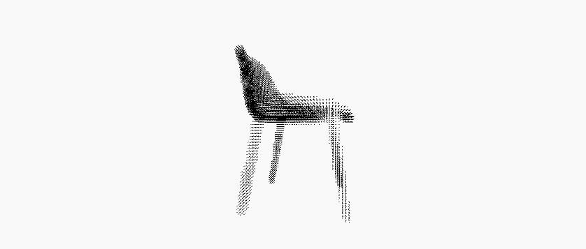

# An unofficial pyotrch implement of 3D-RecGAN (ICCV Workshops 2017)

The official implement (python2.7+**tensorflow**):https://github.com/Yang7879/3D-RecGAN

Bo Yang, Hongkai Wen, Sen Wang, Ronald Clark, Andrew Markham, Niki Trigoni. In ICCV Workshops, 2017.

https://arxiv.org/abs/1708.07969

## 1. Requirements

- Python \>= 3.5 (3.6 recommended)
- Training : [pytorch](https://github.com/pytorch/pytorch)>=1.0
- torchvision>=0.4.0
- tqdm

## 2. Process

## 3. Re-implement visualization
Input:

Ground Truth:

3D-RecAE(L1 loss):

3D-RecAE(CE loss):

3D-RecGAN:

## 4. Data(Provided by author)

https://drive.google.com/open?id=1n4qQzSd_S6Isd6WjKD_sq6LKqn4tiQm9

Data are also available at Baidu Pan:

https://pan.baidu.com/s/165IXaA_JISCwGzTUCiuPig 提取码: gbp2

## 5. Run
### 5.1 Train

`python train.py -c config.json`

### 5.2 Test

`python test.py -c config.json`

### 5.3 Gif visualization

1. Transfer the generated **ply** file to **off** format. (Recommend **meshlab**)
2. Open the **unity** project in `visualization` dir.
3. Modify the `Data Path` in `Point Cloud Manager` script of `Main Camera`. (PS: relative path to `assert` dir)
4. Run the unity project and the projected images around 3D object will be saved.
5. Transfer the saved images to gif. (Recommend https://www.iloveimg.com/)

## 6. Experiments

### 6.1 Per-category IoU and CE Loss

#### 6.1.1 Results in paper :

|                   |  IOU  |       |        | CE Loss  |       |        |
| :---------------: | :---: | :---: | :----: | :------: | :---: | :----: |
| trained/tested on | chair | stool | toilet | chair    | stool | toilet |
| 3D-RecAE(CE loss) | 0.633 | 0.488 | 0.520  |  0.069   | 0.085 | 0.166  |
|     3D-RecGAN     | 0.661 | 0.501 | 0.569  |  0.074   | 0.083 | 0.157  |

#### 6.1.2 Re-implement:

|                   |  IOU  |       |        | CE Loss  |       |        |
| :---------------: | :---: | :---: | :----: | :------: | :---: | :----: |
| trained/tested on | chair | stool | toilet | chair    | stool | toilet |
| 3D-RecAE(CE loss) | 0.5931|   *   |   *    | 0.0547   |   *   |   *    |
| 3D-RecAE(L1 loss) | 0.5171|   *   |   *    | 0.4769   |   *   |   *    |
|     3D-RecGAN     | 0.4478|   *   |   *    | 0.0805   |   *   |   *    |

## 7. Todo

- [x] RecGAN : Per-category IoU and CE Loss
- [x] RecAE : Per-category IoU and CE Loss
- [ ] Multi-category IoU and CE Loss
- [ ] Cross-category IoU and CE Loss

## 8. Reference repo

- https://github.com/Yang7879/3D-RecGAN
- https://github.com/wolny/pytorch-3dunet
- https://github.com/moemen95/Pytorch-Project-Template